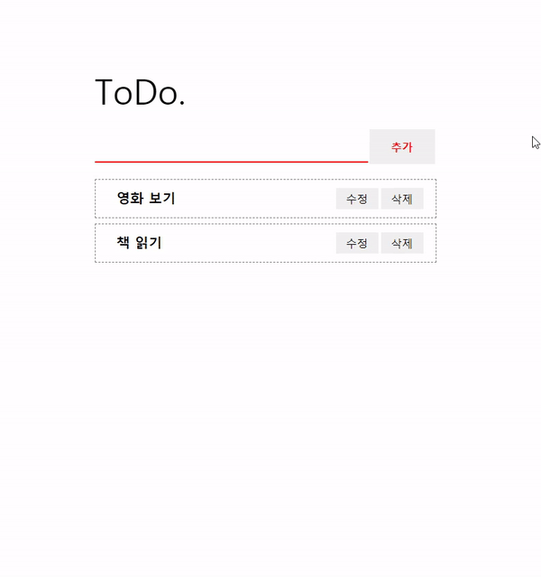

# Todolist-hooks-redux

> Hooks와 Redux를 사용하여 Todolist를 개발해본다.

## 👑 Overview

## ⚙ Spec

- **React.JS**
- **Redux.JS**
- **Hooks**

## 📗 Document

#### [Initial setup](https://github.com/leehosu/Todolist-hooks-redux/blob/develop/document/md/init.md)

#### [build React](https://github.com/leehosu/Todolist-hooks-redux/blob/develop/document/md/build_react.md)

#### [build Redux](https://github.com/leehosu/Todolist-hooks-redux/blob/develop/document/md/build_redux.md)

#### [build Container](https://github.com/leehosu/Todolist-hooks-redux/blob/develop/document/md/build_container.md)

#### [build Component](https://github.com/leehosu/Todolist-hooks-redux/blob/develop/document/md/build_component.md)
